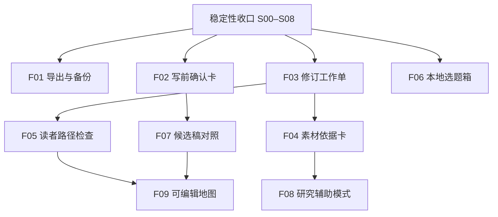

# 新功能分阶段开发计划

日期：2026-09-13。状态：F01–F06 工程实现已完成，其中 F02–F05 的真实使用效果继续评估；F07–F09 仍为条件候选。当前执行顺序见 [下一阶段优先级](NEXT_DEVELOPMENT_PRIORITIES_2026_09_13.md)，产品理由见 [路线图](PRODUCT_EVOLUTION_ROADMAP.md)。前置的 [S00–S08 稳定性计划](../archive/2026-09-13/V0_1_STABILIZATION_DEVELOPMENT_PLAN.md) 已完成并归档。

## 1. 实施约定

本文件给出候选功能的任务、数据/API 方向、测试与退出条件。API 路径和字段是待规格化设计，不是当前已经存在的接口。

- 选定一个批次后，为它编写扩展规格：用户流程、数据、API、失败语义、验收与范围，再进入代码。
- 默认沿用 FastAPI、SQLite、无构建 SPA 与可替换 engine adapter；模型提示词外置，结构化结果有 schema 校验。
- 生成/检查产生提案；用户确认才修改选定角度、事实关联或当前正文。新增模型调用均由明确操作触发且有界。
- 数据修改遵守 S02 事务/revision 契约，正文相关对象遵守 S03 版本来源契约，长操作遵守 S04 operation 契约。
- 不因单个新功能失败破坏原有写作流程。可以关闭入口，但不能删除已有用户数据作为回退办法。
- 开发估计包括实现及针对性验收，不含人工试用等待；F08/F09 先估可行性验证，尚不足以承诺完整开发周期。

## 2. 功能依赖图



F04/F05 依赖 F03 的可定位、可过期诊断与修订入口；不是要求它们共享一套判断标准。F09 依赖候选稿或等价隔离能力，确保结构试验不直接覆盖当前稿。

## 3. F01：本地导出与备份

状态：已完成 F01-1–F01-6 和 E0–E6 验收。实施证据见 [文本导出报告](../reports/PRODUCT_V0_2_EXPORT_IMPLEMENTATION_REPORT.md) 与 [备份恢复报告](../reports/PRODUCT_V0_2_BACKUP_RESTORE_IMPLEMENTATION_REPORT.md)。原估算为 3–5 人日，保留作为规划基线。

### MVP 用户流程

文章 → 导出 → 当前工作副本/指定版本 → Markdown 或纯文本 → 下载到本地。项目备份单独入口：创建备份 → 查看内容摘要 → 下载；恢复时先校验并预览，再打开恢复出的独立工作区。

### 技术范围与任务

| 编号 | 工作 | 产物 / 验收 |
|---|---|---|
| F01-1 | 定义导出内容契约 | 正文与可选标题；默认不带内部计划、模型日志、检查报告 |
| F01-2 | 新增只读导出服务与 API | 建议 `GET /versions/{id}/export?format=md|txt`；当前稿导出必须校验 revision |
| F01-3 | 接入工具栏 | 保存成功后按返回 revision 导出；保存失败保留输入，不导出旧稿冒充当前稿 |
| F01-4 | 定义备份包 manifest/schema | 格式版本、导出时间、对象计数、文件校验值、数据库快照及关联产物；排除密钥/settings/env |
| F01-5 | 一致性备份与恢复预检 | 活跃 SQLite 使用一致性快照；导入先验证版本、结构、引用关系与大小限制 |
| F01-6 | 恢复为独立库/目录 | 恢复失败清理临时产物，当前工作库不变；先不实现合并两个项目库 |

建议新增 `workbench/exporting.py` 与 `workbench/backup.py`，路由仍由 `api.py` 连接。第一版备份恢复可选择全工作区；项目级包可在关系子集正确性验证后追加，不能只拷贝 Project 行。

### 测试与放行

- 中文、换行、空行、表情与 Markdown 字符导出一致；导出本身不创建版本。
- 手工编辑尚未保存、保存失败、导出时另一标签页改稿，都不会无提示地输出错误版本。
- 备份/恢复往返后 tasks、drafts、versions、sources、关联记录与当前正文一致。
- 错误格式、缺失关联、损坏文件、压缩包越界路径被拒绝；失败不动当前库。
- 验收后分别记录导出使用与恢复演练结果；没有完成恢复验收时只能交付导出。

## 4. F02：写前确认卡

优先级：第一批核心功能。预计 3–5 人日。

实现状态（2026-09-13）：F02-1～F02-5 已完成并通过 Python 全量与浏览器 B13；F02-6 的固定 mock 编排试用已完成，真实候选质量、等待与最终保留率继续按试用指标收集。增量规格与证据见 `docs/narrative-writing-product-v0.3-angle-confirmation-spec/` 和 `docs/reports/PRODUCT_V0_3_ANGLE_CONFIRMATION_IMPLEMENTATION_REPORT.md`。

### MVP 用户流程

Quick Write 保留“直接写”，新增可选“先定角度”。系统发现候选 → 展示简短卡片 → 用户选择或编辑 → 确认 → 使用该含义生成正文。第一次候选不满意时用户可再触发一次；不存在自动无限寻找角度。

### 数据与接口建议

- 沿用 `meaning_discoveries` 的不可变产物；新增父 discovery 关联与选择来源字段，记录用户从哪个候选确认。
- 确认产生一条新的、通过 schema 校验的 meaning 快照，保留原 discovery，不能原地改写已被版本引用的结果。
- `POST /tasks/{id}/angle-options`：只发现角度，产生 operation，不启动 Writer。
- `GET /tasks/{id}/angle-options?discovery_id=...`：仅返回安全的候选展示字段，不返回完整内部输出。
- `POST /tasks/{id}/confirm-angle`：提交 discovery_id、candidate_id、允许编辑的字段与输入指纹；返回 confirmed_meaning_id。
- `POST /tasks/{id}/generate` 增加明确的 confirmed_meaning_id；校验任务归属、输入未过期与已确认状态，再走原结构/写作流程。

### 任务拆分

| 编号 | 工作 | 验收 |
|---|---|---|
| F02-1 | 解耦发现与写作的产品编排 | 只看候选时没有新正文/Version，调用数可核对 |
| F02-2 | 编写候选安全投影与确认 schema | 3–5 个候选有主张、机制、问题、边界和读者收获；无内部日志 |
| F02-3 | 实现确认快照与输入指纹检查 | 非当前任务的 candidate、已过期输入被拒绝；用户修改不被暗中覆盖 |
| F02-4 | 前端卡片、可选编辑、直接写旁路 | 复用现有 Quick Write 与 Workspace；无第二套编辑器 |
| F02-5 | 连接 WIR 生成与失败续跑 | Writer 失败后仍保留已确认角度；重试不重新替用户选择 |
| F02-6 | 固定案例试用与记录 | 比较错角度重写次数、总等待和最终保留情况 |

### 边界与失败处理

切换写作模式、话题或相关素材后，旧候选保留为历史但不能无提示地继续使用。自定义角度的最终内容以用户确认为准。确认快照必须同步其 core_question、deep_meaning 等相关字段，不能只改卡片标题而让 Writer 使用旧含义。

可编辑字段引起语义不一致时，提供明确的“重新整理此角度”操作并再次确认；不能在确认后后台改写用户角度。原有默认直接写链路保持回归覆盖。

## 5. F03：修订工作单与保留片段

实施状态：已于 2026-09-13 完成 F03-1～F03-6；F03-7 的真实使用对照数据待收集。规格与验收证据见 `docs/narrative-writing-product-v0.4-revision-worklist-spec/` 和 `docs/reports/PRODUCT_V0_4_REVISION_WORKLIST_IMPLEMENTATION_REPORT.md`。

优先级：第二批核心功能。预计 4–6 人日。

### MVP 用户流程

检查 → 优先三项问题 → 查看对应正文 → 标记保留片段 → 对一项请求修订 → 对照 → 接受/跳过 → 更新工作单。

### 数据与接口建议

- `revision_items`：task/draft、review_id、内容 hash/revision、位置与原文引用、问题、修改目标、状态、关联 patch_id。
- 状态：`open / proposed / resolved / dismissed / stale`；接受 patch 只解决关联问题，其他条目重新检查是否仍有效。
- `preserved_spans`：草稿、基准 revision、确切原文引用与服务端定位。初版不自动跨相似文本模糊重定位。
- 新增工作单查询/状态更新与保留片段 API；生成修改继续使用现有 patch 服务，避免第二套接受流程。

### 任务拆分

| 编号 | 工作 | 验收 |
|---|---|---|
| F03-1 | 将 Review 结果映射为可行动条目 | 每项有位置、具体影响与目标；无位置或引用不匹配的条目不提供精确“修这里” |
| F03-2 | 实现可靠文本锚定 | 基于原文引用、内容 hash 与明确索引语义；覆盖重复段落、Unicode、表情和空行 |
| F03-3 | 实现保留片段 | Patch 结果在拼接前做确定性保护检查；不能只依赖模型承诺 |
| F03-4 | 实现工作单持久化与过期规则 | 编辑/接受/恢复后重算条目有效性；保留条目无法定位时明确提示 |
| F03-5 | 前端问题排序与逐项处理 | 接受前可看 Before/After；跳过不改正文；不默认连续生成所有补丁 |
| F03-6 | 接受事务内更新工作单关系 | 正文提交成功和条目标记解决一致；失败保持待处理状态 |
| F03-7 | 对照试用 | 记录修订耗时、接受后撤销/恢复，以及人为核实的改进 |

初版同一时刻只处理一个当前提案。下一项基于接受后的 revision 重新生成；不把三个旧补丁直接批量套用。诊断模型与提示词重用现有 Review 能力，新增输出契约时必须可由 mock 和 real 一致提供。

## 6. F04：论点与素材依据卡

优先级：第二批，面向 source_grounded 非虚构。预计 5–8 人日。

实施状态：已于 2026-09-13 完成 F04-1～F04-6；F04-7 的真实模型误报、漏报与核查时间待收集。规格与工程验收见 `docs/narrative-writing-product-v0.5-evidence-cards-spec/` 和 `docs/reports/PRODUCT_V0_5_EVIDENCE_CARDS_IMPLEMENTATION_REPORT.md`。

### MVP 用户流程

当前稿件 → 检查材料依据 → 关键陈述卡 → 查看材料原句 → 确认关系/标记待补 → 补材料或发起局部修订。

### 数据与接口建议

- `claim_checks`：task、被检查正文 hash/revision、检查 operation、模型/提示词版本。
- `claim_links`：正文引用及位置、source_id、source_content_hash、素材引用及位置、关系、用户确认状态。
- 支持关系与用户动作分字段：`supported / inference / insufficient / conflict` 与 `unreviewed / confirmed / dismissed`。用户 confirmed 不等于客观真实性认证。
- `POST /tasks/{id}/check-evidence` 只使用显式关联的 Source；GET 读取结果；用户确认/驳回只修改判断记录。

### 任务拆分

| 编号 | 工作 | 验收 |
|---|---|---|
| F04-1 | 编写陈述抽取与材料关联 schema、外置提示词 | 区分事实、作者推断和价值判断；限定数量与输入规模 |
| F04-2 | 建立少量人工标注的正反样例 | 包括真实支持、部分支持、相反材料、无关材料和数字错配 |
| F04-3 | adapter 有界调用与确定性引用校验 | 引文必须存在于对应版本材料，关联 ID 必须属于此任务；失败项不得显示“有依据” |
| F04-4 | 建立内容与 Source 变更后的过期机制 | 新材料或新正文不沿用未经重新检查的通过状态 |
| F04-5 | 前端正文—依据卡—素材定位 | 用户能看到原句和限定条件，不只看到颜色与评分 |
| F04-6 | 接入 F03 的局部修订 | 指定“删去此陈述/改为推断/补入材料限制”，生成提案而非直接改稿 |
| F04-7 | 评估误报与漏报 | 分别报告错误支持关系、漏掉的重要陈述与用户核查时间 |

第一版仅处理规模受限且用户选定的材料集合；超过上限时要求缩小范围，不能静默截断后声称检查完整。没有素材的 topic_only 可提示添加 Source，但不会自动伪造材料或启动联网研究。

## 7. F05：读者路径检查

优先级：实验。预计 5–8 人日，其中先用 1–2 日做离线样例验证。

实施状态：已于 2026-09-13 完成 F05-1～F05-4 的工程实现与固定样例门槛；F05-5 的真实模型命中、修订改善和等待成本待评估。规格与工程验收见 `docs/narrative-writing-product-v0.6-reader-path-spec/` 和 `docs/reports/PRODUCT_V0_6_READER_PATH_IMPLEMENTATION_REPORT.md`。

### 最小设计

从实际正文生成只读诊断：段落主作用、增加的认识、留下/回答的问题、重复或跳跃的引用依据。与“原定结构”分开显示。

数据可复用 review 操作与诊断框架，增加 `analysis_type=reader_path` 及经过 schema 校验的产物；锚定和过期机制复用 F03。API 建议为 `POST /tasks/{id}/reader-path-review`。

| 编号 | 工作 | 验收 |
|---|---|---|
| F05-1 | 在固定稿件上比较现有 Review 与新诊断 | 能发现被人工认可的具体问题；只复述评分则停止独立功能 |
| F05-2 | 设计产物 schema 和引用校验 | 每项判断有正文位置；不输出自称真实读者反应的确定结论 |
| F05-3 | 建立逐段路径视图与问题导航 | 清楚区分原定路径、当前稿检查和已过期检查 |
| F05-4 | 问题转成 F03 修订项 | 保留原问题与定位；失败不影响正文 |
| F05-5 | 用修订后效果判断收益 | 比较问题命中、修订改善与新增等待成本 |

若命中率或可操作性不足，保留离线实验结果，关闭新入口；不继续扩大成复杂图谱。

## 8. F06：本地选题箱

实施状态：Product V0.7 工程实现已完成；专项测试、全量 369 项与浏览器 B17 通过。规格和结果见 [V0.7](../narrative-writing-product-v0.7-idea-box-spec/README.md) 与 [实施报告](../reports/PRODUCT_V0_7_IDEA_BOX_IMPLEMENTATION_REPORT.md)。

### 最小设计

收藏、备注、标签、待写/已写/归档、关联任务；数据存在本地 SQLite。已生成但未收藏的候选是否长期保留，由界面明确区分。

| 编号 | 工作 | 验收 |
|---|---|---|
| F06-1 | 新增 idea 记录与任务关联 | 保存 topic、备注、领域、来源、状态和时间；不保存账户密钥 |
| F06-2 | 一次性迁移现有 localStorage 选题 | 幂等导入；服务端确认成功前保留浏览器原记录；迁移结果有计数 |
| F06-3 | 添加查询、收藏、归档与打开任务 API | 关键词搜索与简单过滤；不引入向量检索 |
| F06-4 | Quick Write 侧栏复用 | 能找到历史收藏并继续写，已写题目可打开原任务 |
| F06-5 | 接入 F01 备份 | 浏览器缓存清空后仍能读取已迁移选题；重复导入不重复创建 |

合并重复题目采用明确的标准化相等与来源键。相似但含义不同的题目不能自动合并。入口可回退到现有建议列表，新数据仍留在库中。

## 9. F07：候选稿对照与选用

优先级：按重写/换角度使用情况选择。预计 4–6 人日。

### 最小设计

用户点击“另写一个方案” → 生成候选 → 与当前稿对照 → 选用或放弃。已有普通生成语义保持不变；候选生成是明确的新动作。

建议 `draft_candidates` 记录 operation、原始基稿 revision、内容、meaning/plan 来源、输入配置快照与状态。候选不是 accepted Version；用户选用时才在事务中创建 generation 来源的 Version，并记录 candidate 关联与产品级来源文案。

| 编号 | 工作 | 验收 |
|---|---|---|
| F07-1 | 将生成产物与提交当前稿拆成可复用两个步骤 | 候选产生后 current draft、current version 不变 |
| F07-2 | 候选创建、查看、放弃接口 | `POST /tasks/{id}/draft-candidates` 由用户逐次触发；失败不产生空候选 |
| F07-3 | 复用现有 diff，显示方案输入与角度差异 | 用户理解比较的是表达还是角度，默认只比较两份 |
| F07-4 | 实现选用事务 | 核验 expected_revision；当前稿已改变时要求重新比较；选用可逆 |
| F07-5 | 版本来源与备份集成 | 采用的角度、结构、操作记录均指向所选候选 |
| F07-6 | 小样本使用评估 | 记录最终选用、总等待与是否更难决定 |

第一版不做自动拼接两个候选的段落，也不默认并发生成多稿。选用失败仍可查看候选，不能通过重跑模型来“恢复”已经产生的内容。

## 10. F08：研究辅助模式的阶段计划

状态：当前范围外的后续候选；本次仅规划。前置：F04 的来源关联可靠，确有材料准备瓶颈。

### 阶段 A：2–3 人日可行性验证

| 编号 | 工作 | 退出标准 |
|---|---|---|
| F08-1 | 收集 3–5 个真实的缺材料任务，固定研究问题 | 明确要找什么、何时算足够，避免泛泛搜一切 |
| F08-2 | 先用人工选择的来源走完 Source → 依据检查 → 写作 | 证明输入材料确实改善输出；否则不进入联网开发 |
| F08-3 | 写独立研究模式规格 | 明确检索触发、次数/预算、日期范围、来源选择和失败处理 |

### 阶段 B：规格成立后的最小实现拆分

1. 增加可替换研究 adapter，仅实现一种可用提供方；所有调用受单次用户请求和预算约束。
2. `research_sessions` 记录问题、范围与操作；候选来源带 URL、标题、抓取时间和可获得的发布日期，缺失信息明确留空。
3. 用户选择后保存显式 Source，带内容快照、来源地址与提取元数据；候选网页不自动成为可信事实。
4. F04 建立陈述到来源片段的关联，生成可回查引用；不可访问或找不到片段的来源不得作为“已验证”。
5. 浏览器验收覆盖无结果、来源冲突、抓取失败、预算用尽和材料不足；写作失败不删除已选来源。
6. 用相同写作任务比较人工准备与研究辅助的时间、材料质量和文章效果，决定是否扩展提供方。

阶段 B 在提供方能力与输入边界明确后重新估时。本规划不以“RAG/向量库”作为默认前置，也不创建自动跟踪热点或持续研究循环。

## 11. F09：可编辑写作地图的阶段计划

状态：当前范围外的后续候选；本次仅规划。前置：F05 的定位与实际问题识别通过验证，F07 或等价候选隔离可用。

### 阶段 A：2–3 人日可行性验证

| 编号 | 工作 | 退出标准 |
|---|---|---|
| F09-1 | 选择确需调整顺序的短稿 | 用户能明确指出期望的顺序变化与必须保留片段 |
| F09-2 | 人工标注结构单元及跨段依赖 | 不依赖当前均分段落启发式作为精确映射 |
| F09-3 | 只试相邻两个单元交换，离线生成修改提案 | 检查指代、铺垫、反例与结尾影响是否能界定 |

### 阶段 B：验证有效后的开发拆分

1. 定义产品级结构单元与修改提案，保留原始 plan；产品操作通过 adapter 转换，避免静默改变 WIR 语义。
2. 用户调整顺序后先展示受影响范围与保留约束，不直接改正文。
3. 生成新的结构方案和候选正文；跨范围影响超过最小操作能力时明确退回，不能偷偷扩大为全文重写。
4. 逐项查看改动，采用后生成新版本并关联新的 plan；拒绝保留原稿。
5. 覆盖重复段落、跨段指代、非相邻依赖、事实/措辞锁冲突以及回退。
6. 对照纯文本说明意图的旧流程，证明可视化操作降低了修改成本，再扩展移动、合并等动作。

如需要改变引擎语义，先形成单独的引擎变更评审与实验，不能借产品拖拽界面绕过现有引擎范围规则。

## 12. 建议下一批实际选择

| 顺序 | 任务范围 | 放行条件 |
|---|---|---|
| P0-A | 基础初稿、F02、F03 核心质量评估 | v2 匿名工具已准备完成；下一步生成固定真实结果并回收至少两名独立评审者，分别回答初稿是否可用、角度是否减少重写、修订是否改善且不伤害上下文 |
| P0-B | B09–B17 真实浏览器人工验收 | 与 P0-A 并行，先验 B09/B10/B13/B14 核心主链路，再验 B11/B12/B17 数据信任；阻断问题关闭 |
| 已完成 | F06-1～F06-5 本地选题箱 | SQLite 持久化、幂等迁移、搜索/继续写、备份恢复和 B17 自动化已通过 |
| P1 | F04-7、F05-5 分项效果评估 | F04 单报错误支持/遗漏/核查时间；F05 单报相对 Review 的新增有效问题和等待 |
| P2 | F07 候选稿对照 | 真实使用出现保留两稿比较的需求后进入规格 |
| P3 | F08 阶段 A | F04 判断质量通过，且材料准备是已观察到的瓶颈 |
| P4 | F09 阶段 A | F05 定位有效，候选隔离可用，且有调整结构顺序的真实需求 |

核心质量评审工具准备已完成；真实评审回收与人工交互走查可并行执行。P2–P4 按证据选择一项，不能默认连续开发。

## 13. F10：文章分享与独立阅读页

状态：用户提出后已完成 V0.8 规格、S0–S6 实现和自动验收。规格与实现证据见 [Product V0.8](../narrative-writing-product-v0.8-sharing-spec/README.md) 和 [实施报告](../reports/PRODUCT_V0_8_SHARING_IMPLEMENTATION_REPORT.md)。

### 已交付流程

```text
当前保存稿 → 生成不可变快照 → 复制链接 / 保存卡片
→ 读者打开独立文章页 → 作者更新快照或停止分享
```

实现使用当前站点 origin 和随机 token，不连接第三方发布平台。公开响应只包含文章白名单字段；编辑后的正文不会静默改变旧快照。更新分享会换新链接，停止分享、删除任务或项目都会使链接失效。

### 后续开发计划

| 优先级 | 工作 | 启动条件与验收 |
|---|---|---|
| P0 | 真实手机访问与部署说明 | Workbench 已部署到手机可访问地址；Safari/Chrome 验证标题、正文、系统分享、长文滚动和安全区 |
| P1 | 分享卡片视觉微调 | 收集真实文章卡片样本后调整长标题、摘要截断和署名排版；1080×1440 下载继续可读 |
| P2 | 可选封面图 | 用户确有多篇对外分享需求；先定义上传、裁切、备份和公开隐私边界，不自动使用素材图 |
| P3 | 访问范围 | 出现“仅指定读者/设置有效期”的明确需求后另写认证规格；不能把不可猜 token 描述为身份认证 |

阅读统计、评论、关注、推荐流和第三方平台代发布仍不进入当前计划。

## 14. 每项功能统一验收模板

```text
功能编号 / 规格版本：
验证的用户问题：
实际交付范围：
依赖的稳定性任务：
数据迁移及回退演练：
API / schema / prompt 变更：
自动测试结果：
浏览器走查结果：
真实模型与提示词标识（如适用）：
失败案例和已知限制：
人工使用观察与样本量：
结论：继续 / 缩小 / 合并到既有功能 / 暂缓
下一次验证的问题：
```

功能是否有效取决于它改善了写作过程中的哪个问题。若没有清楚收益，保留实验记录并缩小范围，比持续增加界面和模型调用更有价值。
