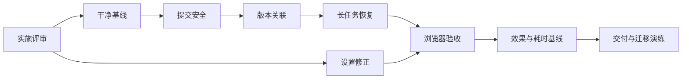

# V0.1 稳定性与验收：详细开发计划

日期：2026-09-13。状态：开发中；原始估算与初始表保留，实际进展见 [开发日志](../reports/DEVELOPMENT_PROGRESS.md)。事实基线见 [现状报告](../reports/PROJECT_STATUS_AND_NEXT_STEPS_2026_09_13.md)，后续功能见 [产品路线图](PRODUCT_EVOLUTION_ROADMAP.md)。

## 1. 目标与完成定义

这一轮让现有三种入口在常见失败、刷新、并发点击和版本恢复下可靠工作，并建立可重复的交付与质量基线。

完成须同时满足：

1. 并发接受同一补丁至多提交一个版本，失败不会留下半完成状态。
2. autosave、接受、恢复、生成提交之间不会由旧请求覆盖新正文。
3. 当前稿件、角度、结构来源与审阅输入对应；续跑产物与已接受稿件分开读取。
4. 无私人数据和密钥的干净环境可通过常规测试并启动 mock。
5. 浏览器中完整走通三种入口及修订、拒绝、接受、恢复、刷新和重试。
6. 当前模型与提示词下的成功/失败、耗时和人工效果评价有可追溯记录。

既有引擎语义、默认快速写作入口、用户接受补丁的规则保持为设计约束。主要修改落在产品层；发现必须调整引擎内部的情况时，应单独记录必要性与规格影响。

## 2. 里程碑、依赖与工作量

| 编号 | 里程碑 | 依赖 | 预计人日 | 初始状态 |
|---|---|---|---|---|
| S00 | 实施评审与可复现问题清单 | 无 | 0.5 | 未开始 |
| S01 | 干净环境与测试基线 | S00 | 0.5–1 | 未开始 |
| S02 | 事务、冲突检测与原子提交 | S01 | 2–2.5 | 未开始 |
| S03 | 版本来源与诊断一致性 | S02 | 1.5–2 | 未开始 |
| S04 | 长任务生命周期与恢复 | S02、S03 | 1–1.5 | 未开始 |
| S05 | 设置与产品反馈修正 | S00；集成验收依赖 S04 | 0.5–1 | 未开始 |
| S06 | 浏览器主流程验收 | S01–S05 | 1 | 未开始 |
| S07 | 阶段记录与效果基线 | 记录方案在 S04 落地；采样在 S06 后 | 1–1.5 | 未开始 |
| S08 | 数据迁移演练、文档与交付 | S01–S07 | 0.5–1 | 未开始 |

基准工作量约 9–12 人日，另预留 2–3 人日应对旧数据库迁移及浏览器差异，整体预算约 11–15 人日。上一轮“8–12 日”是粗估，此处给出了更细拆分与独立风险储备。人工盲评等待时间单列，不承诺两周内回收。



## 3. S00：实施评审与范围固定

| 子任务 | 操作 | 产出 / 验收 |
|---|---|---|
| S00-1 | 在 `PRODUCT_IMPLEMENTATION_REVIEW.md` 增加本轮评审；Quick Write 相关决定同步对应 review | 写明事务边界、版本关系、运行状态、API 变更、迁移与测试 |
| S00-2 | 保存当前 Git 基线，检查已有 `app.js` 修改和 `.commandcode/` 的归属 | 原有工作被保留；新提交不混入无关文件 |
| S00-3 | 把现状报告中的五项已复现问题转成可执行回归案例 | 每个案例能在合成数据上复现；区分已确认问题与待验证风险 |
| S00-4 | 固定当前产品契约和扩展决定索引 | 记录顺序重复接受仍返回已解决/冲突；新字段的兼容方式明确 |

分支建议使用 `codex/` 前缀；每个里程碑形成可独立评审的提交。本轮规划本身不创建分支、提交或 PR。

## 4. S01：干净环境与测试基线

| 子任务 | 主要文件 | 实施要求 |
|---|---|---|
| S01-1 | `tests/test_benchmark.py`、拟新增 `tests/fixtures/` | 用可入库的合成 cases 验证 schema/加载行为；私人实验读取改为单独可选入口 |
| S01-2 | requirements 文件、拟新增测试依赖文件 | 明确测试客户端和浏览器驱动依赖；记录实际验证过的 Python 版本及安装命令 |
| S01-3 | 拟新增 CI 配置 | 干净检出运行 pytest 与 JS 语法检查；浏览器主流程在 S06 加入；不读取真实密钥 |
| S01-4 | 测试运行脚本 | 全部使用临时数据库、临时 settings 和合成输入；mock 服务器就绪/关闭可检测 |

验收：已跟踪文件的干净副本完成全量常规测试；缺少私人 benchmark 不再失败。真实实验数据继续忽略，不能为使 CI 通过而上传私人样例。

## 5. S02：事务与冲突控制

### 5.1 推荐数据/API 契约（待实施评审固定）

| 对象 | 拟增加内容 | 用途 |
|---|---|---|
| Draft | 单调递增的 `revision` | 区分同一 Version 上的手工编辑，避免只比较 version_id 漏检 |
| ProposedPatch | `base_revision`、接受后的 version 关联 | 把补丁绑定到生成提案时的工作副本，支持响应丢失后的状态核对 |
| 修改正文的请求 | `expected_revision` | 服务端比较并拒绝过期写入，成功返回新 revision |

前后端一起升级；缺失 revision 的写入不能默默降级成无条件覆盖。需要兼容旧标签页时返回明确的刷新提示。全量选区外编辑也先按冲突处理，不在本轮自动合并。

### 5.2 任务拆分

| 子任务 | 文件 / 边界 | 具体工作 |
|---|---|---|
| S02-1 | `workbench/db.py` | 增加显式事务上下文；锁覆盖整个短事务；异常 rollback；提供事务内不自动 commit 的查询/写入入口 |
| S02-2 | `Service.accept_patch/reject_patch` | 校验状态、基稿与选区，插入版本、更新正文和补丁状态原子完成；检查条件更新行数 |
| S02-3 | `autosave/checkpoint/restore_version` | 应用 revision 检查与原子提交，统一冲突错误；去重 checkpoint 不增加无意义版本 |
| S02-4 | `_generate_with` 的提交阶段 | 模型调用外捕获输入与正文基线；完成后做条件提交；冲突时保存生成产物并返回错误，不覆盖新正文 |
| S02-5 | `api.py`、前端保存/接受/恢复逻辑 | 传递并更新 revision；冲突保留本地输入，提供重载服务端稿件的明确路径 |

数据库事务不包含 LLM 网络调用。当前连接共用且使用非重入锁，不能在持锁事务内继续调用会重复取锁并自动提交的旧 helper；必须通过事务句柄执行。无需为此引入 ORM 或分布式锁。

### 5.3 必须通过的回归

- 同一 patch 并发接受：仅一个调用提交；另一调用得到已解决/冲突，版本总数只增加一。
- 接受与拒绝同时发生：只有一个终态成立，正文与终态一致。
- 在每个持久化步骤注入失败：版本、正文、patch 状态全部回到操作前。
- 旧 autosave 在接受或恢复之后到达：被拒绝，不覆盖新稿。
- 生成期间手工编辑或另一次恢复：迟到生成不得覆盖更新后的工作副本。
- 锁冲突、选区变化、双标签页修改：错误可理解，原内容仍可恢复。

## 6. S03：版本来源与诊断一致性

### 6.1 数据语义

推荐增加 `versions.engine_plan_id`，meaning 经 plan 关联；原始用户导入稿、无法确定来源的历史版本允许为空。`restore_source_version_id` 记录恢复来源，不能用 parent_version_id 替代：parent 表示操作前当前版本，restore source 表示内容取自哪个版本。

| 操作 | 版本的结构来源 | 诊断有效性 |
|---|---|---|
| 初次/再次生成 | 本次成功生成实际使用的 plan | 与生成稿一致，但段落映射仍须标明方法 |
| 接受局部补丁 | 继承基稿 plan 作为原始写作意图 | 正文已变；旧 review 过期，旧映射不能冒充重新分析结果 |
| 手工 checkpoint | 继承基稿来源 | 同上 |
| Restore | 继承被恢复版本的来源 | 恢复其内容；仅复用与该文本及配置匹配的诊断 |
| 失败续跑 | 从运行记录中寻找可复用节点 | 不影响当前稿件的来源与解释 |

Review 增加 `content_hash`、输入 revision 及必要配置快照。原稿被编辑后，旧诊断可留在历史中，但“修这里”需刷新诊断或重新确认位置。

### 6.2 任务拆分

| 子任务 | 操作 | 验收 |
|---|---|---|
| S03-1 | 编写增量迁移，增加版本来源字段及索引 | 可重复执行，旧库不丢版本、不假造精确来源 |
| S03-2 | 分开“当前版本的 plan”和“可续跑 plan”查询 | 当前 UI/review 不再调用任务级 latest plan 兜底 |
| S03-3 | 生成、patch、checkpoint、restore 写入正确关联 | A → B → Restore A 的角度与结构来源恢复为 A |
| S03-4 | Meaning API 区分已接受稿件与当前运行产物 | 首次生成尚无正文仍可看到进度角度；旧稿解释不会被新尝试覆盖 |
| S03-5 | Review 与地图绑定内容版本，处理过期状态 | 新稿不误用旧诊断；保留只读地图的启发式标记 |

历史迁移原则：可证明唯一来源时才回填；否则标记未知。人工编辑后的 map 是原始结构参考，不承诺自动精确对齐。必要时重新审阅比错误地显示“精确来源”更可靠。

## 7. S04：长任务生命周期与失败恢复

目标：区分任务仍在执行、连接断开、调用失败与进程中断。保留单机、单服务进程、用户点击触发的有界执行方式。

建议增加轻量 `writing_operations` 表，记录 operation_id、task_id、种类、进程实例、状态、当前阶段、开始/结束时间、输入快照指纹、错误码、产物关联。输入快照包含模型与配置/提示词标识，不含 API Key。仅增加恢复所需记录，不引入通用任务队列。

```text
running → succeeded
        → failed
        → interrupted（服务重启后发现属于旧进程的未完成操作）
```

重试创建新的 operation，并记录复用哪个失败操作的节点。不要把失败记录原地改成一次从未失败的成功运行。

| 子任务 | 操作 | 验收 |
|---|---|---|
| S04-1 | 原子登记运行占用；使用进程内实际在运行集合配合持久状态 | 同任务生成/审阅不会交错占用通道；运行超过 300 秒不被当作已死 |
| S04-2 | 明确单服务实例约束及启动恢复 | 旧进程操作标为中断，可由用户重试；服务不自动恢复收费模型调用 |
| S04-3 | SSE 事件携带 operation 标识，区分阶段事件与正文预览 | 旧操作迟到事件不进入新操作；断开后重新读取权威状态 |
| S04-4 | 请求开始时固定 adapter 与配置快照 | 用户热切换设置不使同一次生成混用两套配置 |
| S04-5 | 记录成功节点和可恢复性，校验输入指纹 | 改变素材/角度/关键配置后不错误复用；未改变输入时可跳过已完成节点 |

测试用可控阻塞引擎与模拟时钟覆盖长任务，不让常规测试真正等待五分钟。使用持久临时数据库模拟进程重建。正文 token 可以仅保存在内存预览中，已完成阶段产物与最终状态必须可回查；重启后不要求重放逐 token 动画。

## 8. S05：设置与产品反馈修正

| 子任务 | 实施要求 | 验收案例 |
|---|---|---|
| S05-1 | 模型清单记录 endpoint、请求序号、来源及 loading/success/error 状态 | 预设建议不再被当作端点完整能力列表 |
| S05-2 | 失败保留手填值；响应应用前检查 endpoint 与用户编辑版本 | 请求失败、快速换地址、请求中输入模型都不被覆盖 |
| S05-3 | 按服务端错误信息区分本机断开、提供方连接/认证/模型错误、结构化失败 | 不把所有失败归为“模型名称错误”；含特殊字符的文本安全显示 |
| S05-4 | Review 只显示白名单字段，明确检查通过/需修订/未完成 | real 与 mock 返回不同字段时不显示内部 decision、wq |
| S05-5 | 对照已有未提交改动逐项保留、修正并记录 | 有价值的进度说明保留；误拦截逻辑有独立回归 |

模型清单即使成功也未必穷尽自定义别名；基础策略应为提供建议和明确的连接测试，避免无证据地禁止手填。

## 9. S06：浏览器验收矩阵

建立最小真实浏览器套件，使用临时 mock 服务。先覆盖用户行为，不为每个 DOM 节点编写镜像测试。真实引擎返回形状由可控 adapter 替身覆盖，包括额外 summary 字段。

| 编号 | 场景 | 必验结果 |
|---|---|---|
| B01 | 素材写作 → 生成 → 手改 → 刷新 | 表单与正文分别按其保存规则恢复 |
| B02 | Quick Write → 换角度 → 同角度重写 | 角度变化/复用正确，版本来源可追踪 |
| B03 | 旧稿导入 → Review → 定位 → Patch | 旧稿保持，定位对应当前内容，提案不自动接受 |
| B04 | 拒绝、重试、接受、连续点击接受 | 草稿与版本数符合契约 |
| B05 | 版本 A/B 对照 → Restore A → 查看角度/地图 | 展示来源与被恢复版本一致 |
| B06 | 保存失败、切路由、双标签页旧请求 | 输入不丢，冲突不覆盖 |
| B07 | 生成中刷新、断开 SSE、服务重启 | 显示真实状态，不永久假加载，不自动重跑 |
| B08 | 模型清单失败与快速切换端点 | 手填模型保留，错误来源明确 |
| B09 | 长中文文本、输入法组合输入、粘贴、多段选区 | 不提前打断输入，选区与实际 patch 范围一致 |
| B10 | 桌面常用窗口尺寸、键盘操作、对话框 | 正文为视觉中心，无关键按钮遮挡或键盘死路 |

B01–B08 自动化；B09–B10 至少人工真实浏览器走查并记录结果。自动化与人工未完成项必须如实留在验收报告中。

## 10. S07：阶段记录与效果基线

| 子任务 | 内容 | 产出 |
|---|---|---|
| S07-1 | 保存 discovery 尝试、judge 结论/不可用、结构、检查结果、阶段耗时与可取得 usage | 按 operation 关联的本地产物；缺失 usage 标为未知，不记成零成本 |
| S07-2 | 固定 12 个合成或获准使用的案例：三入口各 4 个 | 案例清单、成功条件、锁定内容及人工评审表 |
| S07-3 | 固定模型、配置和提示词版本，执行有界真实模型冒烟 | 所有失败也入报告；记录阶段调用数与总耗时 |
| S07-4 | 人工评价命题、推进、可辩护性、保留价值与补丁效果 | 分入口统计，样本小只作探索，不宣称统计证明 |
| S07-5 | 回收 V1.2 剩余 23 对盲评，合并既有 17 对 auto-tie | 独立的历史实验分析报告，不与新版本结果混算 |

产品事件仅保存在本地，记录行为与对象关联，不默认采集正文作为遥测。预览生成、已采纳正文、人工编辑量和实际接受行为应分别统计；仅点击按钮不等同于觉得文章好。

S07-5 依赖实际评审者，可提前安排。若人工结果未回收，S08 可交付“工程验收完成、效果评估待补”的明确状态，不能宣布整个完成定义已满足。

## 11. S08：迁移、回退与交付

1. 给每次迁移分配明确版本，先在旧库副本执行，核对对象数、版本链、当前正文与 patch 终态。
2. 迁移前使用 SQLite 一致性备份机制或停服务后备份；不能在活跃写入时只复制主 `.db` 文件并忽略 WAL。
3. 回退演练使用备份恢复到独立路径验证。旧代码不能在未确认兼容的升级库上直接运行；若需回退，先保全升级后的新数据。
4. 修正 README 测试数量、真实运行链路、已验证能力和局限；新增本轮实施报告。
5. 运行一次干净测试、浏览器核心回归和数据库迁移检查。通过后只在新变更或新失败出现时重跑相关验证。

## 12. 建议提交拆分与放行条件

| 提交批次 | 内容 | 放行条件 |
|---|---|---|
| C1 | 评审、合成 fixture、干净环境命令 | S00–S01 完成 |
| C2 | 事务基础与 patch 并发修复 | 故障注入及接受/拒绝竞争通过 |
| C3 | revision 与各类正文写入冲突控制 | 旧 autosave/迟到生成不覆盖 |
| C4 | 版本来源迁移与查询切换 | 恢复、未知来源、失败续跑回归通过 |
| C5 | 运行生命周期与阶段记录 | 长任务、断线、重启、配置切换通过 |
| C6 | 设置与审阅展示修复 | 设置回归及真实返回形状验证通过 |
| C7 | 浏览器套件、迁移演练与实施报告 | 明确工程验收结果和仍待人工评审项 |

每批次记录修改、理由、验证和剩余限制；不要仅以测试数量增加作为完成依据。
